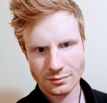

# INFORMATION

**Time**: Dec 8, 2021, 10:20AM PST / 12:20PM CT / 1:20PM ET / 5:20PM GMT / 6:20PM CET

**Zoom Location**: TBD

**Slides**: [pdf](doc/nips21_demo_slides.pdf)

# DESCRIPTION
As machine learning has become increasingly ubiquitous, there has been a growing need to assess the trustworthiness of learned models. One important aspect to model trust is conceptual soundness, i.e., the extent to which a model uses features that are appropriate for its intended task. We present TruLens, a new cross-platform framework for explaining deep network behavior. In our demonstration, we provide an interactive application built on TruLens that we use to explore the conceptual soundness of various pre-trained models. Throughout the presentation, we take the unique perspective that robustness to small-norm adversarial examples is a necessary condition for conceptual soundness; we demonstrate this by comparing explanations on models trained with and without a robust objective. Our demonstration will focus on our end-to-end application, which will be made accessible for the audience to interact with; but we will also provide details on its open-source components, including the TruLens library and the code used to train robust networks.

# Speakers: 

[Anupam Datta](https://www.andrew.cmu.edu/user/danupam/), Carnegie Mellon University

Anupam Datta is a Professor of Electrical & Computer Engineering and Computer Science at Carnegie Mellon University, Co-founder and Chief Scientist of Truera, Director of the Accountable Systems Lab. He received his Ph.D. of Computer Science from Stanford University. His research focuses on enabling real-world complex systems to be accountable for their behavior, especially as they pertain to privacy, fairness, and security.

---

[Matt Fredrikson](https://www.cs.cmu.edu/~mfredrik/), Carnegie Mellon University

Matt Fredrikson is an Assistant Professor of Computer Science at Carnegie Mellon University, where his research aims to make machine learning systems more accountable and reliable by addressing fundamental problems of security, privacy, and fairness that emerge in real-world settings.  

---

[Klas Leino](http://www.cs.cmu.edu/~kleino/), Carnegie Mellon University

Klas Leino is a PhD candidate in the Accountable Systems Lab at Carnegie Mellon University, advised by Matt Fredrikson. His research primarily concentrates on demystifying deep learning and understanding its weaknesses and vulnerabilities in order to improve the security, privacy, and transparency of deep neural networks.  

---

Kaiji Lu, Carnegie Mellon University

Kaiji Lu is a fourth-year Ph.D. student in Electrical and Computer Engineering at Carnegie Mellon University. His research focuses on explainability, fairness and transparency of deep learning models, particular those with applications in Natural Language Processing (NLP).  

---

[Shayak Sen](https://truera.com/people/shayak-sen/), Truera

Shayak Sen is Co-founder and Chief Technology Officer of Truera, a startup providing enterprise-class platform that delivers explainability for Machine Learning models. Shayak obtained his PhD in Computer Science from Carnegie Mellon University where his research aims to make machine learning and big data systems more explainable, privacy compliant, and fair.

---

Ricardo Shih, Truera

Rick is a leader in developing solutions connecting machine learning with
production data science teams. He graduated with a Master’s in Machine Learning from UCSD. Rick has led machine learning efforts in improving e-commerce search, and is currently leading explanation efforts for time series and NLP models.  

---

[Zifan Wang](https://sites.google.com/west.cmu.edu/zifan-wang/home), Carnegie Mellon University

Zifan Wang is a third-year student in the Accountable System Lab at Carnegie Mellon University, co-advised by Anupam Datta and Matt Fredrikson. His concentrations include explanation tools for deep nueral networks and its application for Computer Vision tasks.   

---

# Demo Topics 
## 1. TruLens Usage
*Accompanying Materials*
* Medium Article: [A Hands on Introduction to Explaining Neural Networks](https://medium.com/trulens/a-hands-on-introduction-to-explaining-neural-networks-with-trulens-504bfab1a578)
* Medium Article: [Peer Deep into Neural Networks with TruLens](https://medium.com/trulens/peer-deep-into-neural-networks-with-trulens-a813f22792f7)
* TruLens Guide: [Main Page](https://www.trulens.org/), [API Reference](https://www.trulens.org/api/attribution/)
* PyTorch: 
* Tensorflow 2 / Keras: 

## 2. Using TruLens for Assessing Conceptual Soundness
*Accompanying Materials*
* Towards Data Science Article: [Overfitting and Conceptual Soundness](https://towardsdatascience.com/overfitting-and-conceptual-soundness-3a1fd187a6d4)
* Demo 1: 

## 3. Explanations on Robust Models
*Accompannying Materials*
* Towards Data Science Article: [AI Explainability Requires Robustness](https://towardsdatascience.com/ai-explainability-requires-robustness-2028ac200e9a)
* Towards Data Science Article: [Training Provably-Robust Neural Networks](https://towardsdatascience.com/training-provably-robust-neural-networks-1e15f2d80be2)
* Demo 2: 

# Further Reading
* [Influence-Directed Explanations for Deep Convolutonal Networks](https://arxiv.org/pdf/1802.03788.pdf). Leino et al., ITC 2018.
* [Globally-Robust Neural Networks](https://arxiv.org/pdf/2102.08452.pdf). Leino et al., ICML 2021.
* [Adversarial Examples are not Bugs, They are Features](https://arxiv.org/pdf/1905.02175v3.pdf). Ilyas et al., NIPS 2019.

---

More resources are available on our Github page: [TruLens](https://github.com/truera/trulens)

